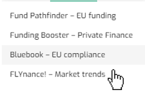
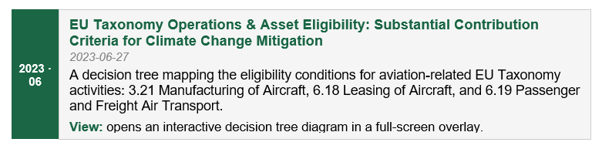
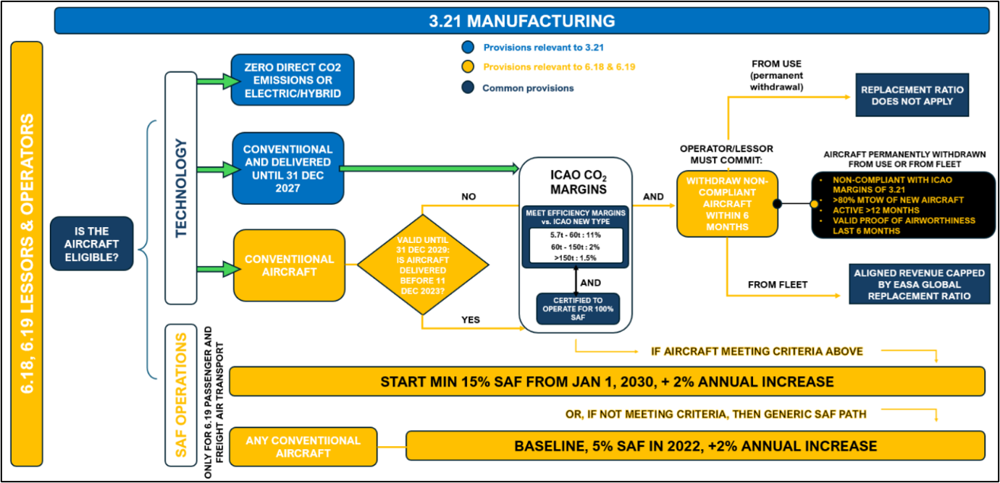
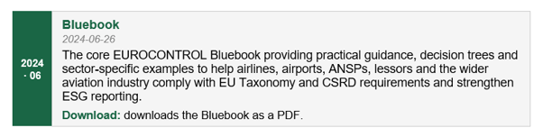
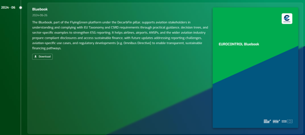
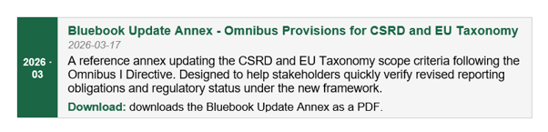
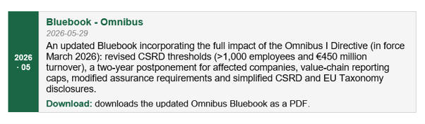
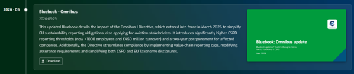

{fig-align="center" width="191"}

------------------------------------------------------------------------

**Default**

The Bluebook section displays a chronological timeline of EUROCONTROL publications on EU Taxonomy and CSRD compliance for the aviation sector. The following four entries are available by default:

{fig-align="center" width="700"}

{fig-align="center" width="700"}

{fig-align="center" width="700"}

{fig-align="center" width="700"}

{fig-align="center" width="700"}

{fig-align="center" width="700"}

{fig-align="center" width="700"}

{fig-align="center" width="700"}

{fig-align="center" width="686"}

------------------------------------------------------------------------

**Output**

The Bluebook section equips aviation stakeholders - airlines, airports, ANSPs, lessors and financial institutions - with the regulatory guidance needed to understand and comply with EU Taxonomy and CSRD requirements. It provides:

• **Decision trees** - visual step-by-step eligibility assessments for EU Taxonomy activities 3.21, 6.18 and 6.19, covering technology criteria, ICAO CO₂ margin thresholds, SAF blending obligations and replacement ratio rules.

• **Practical compliance guidance** - sector-specific examples and structured reference material to prepare compliant ESG disclosures and access sustainable finance.

• **Regulatory updates** - timely annexes and revised editions reflecting changes introduced by the Omnibus I Directive, enabling stakeholders to track evolving obligations without re-reading the full framework.\

------------------------------------------------------------------------

**Data**

The Bluebook summarises the EU Taxonomy and CSRD regulations using and quoting information provided by official EU regulatory websites, material produced by EFRAG, and other non-EU advisory services.

------------------------------------------------------------------------

**Definitions**

Key terms are referenced across the Bluebook publications.
