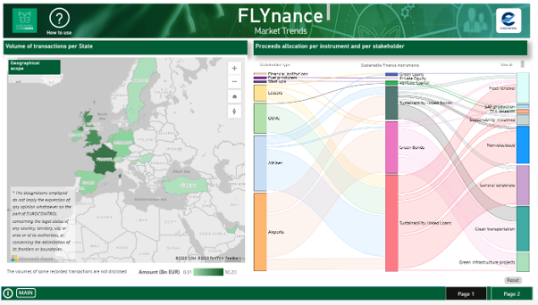
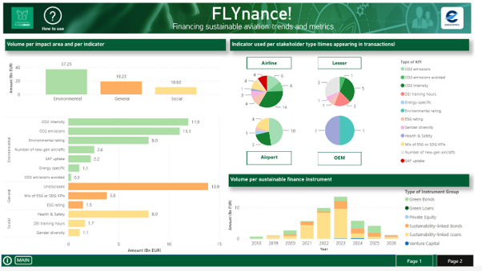

**Default**

-   Volume transactions per State (ECAC & Global)

-   Volume per sustainable finance instrument

-   Volume per impact area and per indicator

-   Proceeds allocation per instrument and per stakeholder

-   Indicator used per stakeholder type

------------------------------------------------------------------------

**Output**

Key volumes per geography, over time and per instrument, per Environmental, Social or General context, per stakeholder type and use of proceeds and finally, indicators appearing in transactions.

{fig-align="center"}

------------------------------------------------------------------------

**Data**

Public data (web).

For a comprehensive list of sources, check the References section.

------------------------------------------------------------------------

**Definitions**

Please consult the [FLYnance! dashboard](https://app.powerbi.com/view?r=eyJrIjoiY2YxNWI4OTAtNmY2NC00ZmZkLWI5NzgtNGRkYTM3OGUxOWFlIiwidCI6Ijc2ZjMzYzIwLTU5NzktNDQwOC1hZGY3LThiM2M0YmU5NWU1MiIsImMiOjl9) for more information on how to read and interact with the visuals.
