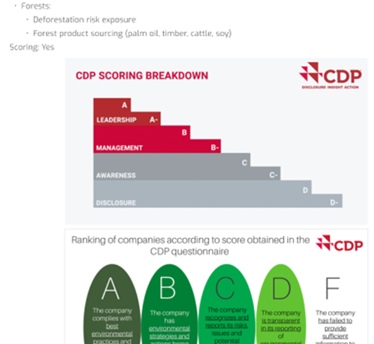
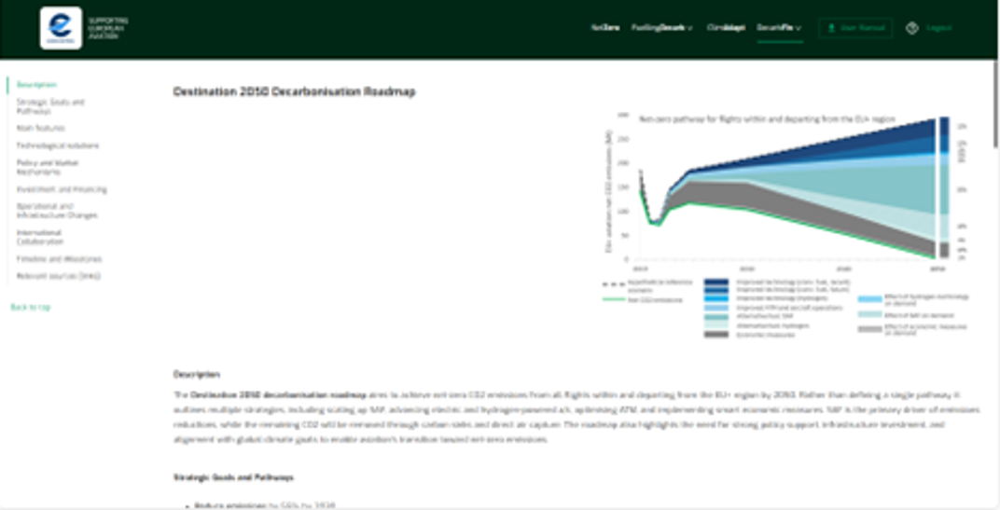
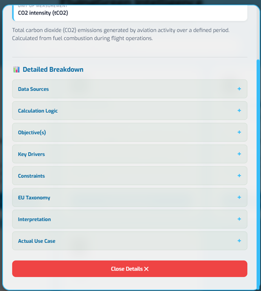

### 1. ESG Frameworks

**Default**

View the following items:

- Purpose of the framework

- Focus Areas

- Key Highlights

- Categories of ESG metrics

- Target Audience

- Relevance with Aviation Sector

- Where to Report

- Cost of Use

- Target Users

- Reporting Period

- Short Conclusion

------------------------------------------------------------------------

**Output**

Each ESG framework is presented in detail. The navigation can be also managed from the navigation menu on the left side.

------------------------------------------------------------------------

**Data**

All information is sourced from publicly accessible sources which are indicated at the bottom of the page. Some of them correspond to the official site of the ESG framework, where applicable (ie. CDP).

{fig-align="center" width="390"}

------------------------------------------------------------------------

**Definitions**

Please consult the Dictionary of terms function.

------------------------------------------------------------------------

### 2. Roadmaps

**Default**

View the following items: - Description of the roadmap

- Strategy Goals it entails

- Main Features

- Technological solutions put forward

- Policy and Market Mechanisms

- Investment and Financing

- Operational and Infrastructure Changes

- International Collaboration

- Timelines/Milestones under its decarbonisation pathways

{fig-align="center" width="470"}

------------------------------------------------------------------------

**Output**

Each roadmap is presented in detail. The navigation can be also managed from the navigation menu on the left side.

------------------------------------------------------------------------

**Data**

All information is sourced from publicly accessible sources which are located at the bottom of the page. They correspond to the official site of the roadmap release (ie. ICAO, IATA, SBTi, etc.).

------------------------------------------------------------------------

**Definitions**

Please consult the Dictionary of terms function.

------------------------------------------------------------------------

### 3. Sustainability Indicators

**Default**

- **Sustainability Indicators** categorized by User segment.

- **EU Taxonomy alignment** for specific aviation activities.

- **User Segment filtering** (Airlines, Airports, Lessors).

- **Detailed breakdown of indicator** covering technical and operational perspectives.

- **Detailed comparison** of selected indicator cards.

------------------------------------------------------------------------

**Output**

A technical database of indicators that align operational aviation information with sustainable finance requirements like EU Taxonomy regulation. It provides a standardized way to view metrics relevant to the **EU Taxonomy Technical Screening Criteria (TSC)** and helps stakeholders identify which KPIs are applicable to their specific business segment and project financing.

------------------------------------------------------------------------

**Data**

The platform utilizes a curated set of aviation-specific sustainability indicators. These are mapped against: the EU Taxonomy Regulation (Activities 6.17, 6.18, 6.19, and 6.20), the User Segment (Airlines, Airports, Lessors), Efficiency-focus and Energy/Fuel relevance. There is a filtering menu on the top left side of the front page where the user can select and filter preferred information.

#### 3.1 How to use the Sustainability Indicators

**Guidelines**

Below are guidelines to help users navigate the catalogue of indicators and the filtering system.

- **Indicator Cards:** Each card represents a unique metric (e.g., CO~2~ intensity, SAF uptake). Clicking a card provides a deep dive into the definition and multi-aspect content of that metric.

  - **Clicking on View Full Details** à the card flips and the user has access to additional information around the indicator.

  {fig-align="center" width="423"}

- **Compare Cards:** Selecting the "click to compare" option top right on multiple cards populates the **Compare Cards (n)** table at the bottom of the screen enabling real-time comparison of each indicator’s drivers simultaneously.

{fig-align="center"}

- **Detailed Comparison:** Clicking this button opens a side-by-side view of the selected indicators to analyze differences in their methodology or applicability.

{fig-align="center" width="580"}

- **Filters Menu:** Located at the top/side, this allows users to narrow down the list of indicators based on specific regulatory or operational needs.

{fig-align="center"}

------------------------------------------------------------------------

**Refine Data (Filters)**

**Efficiency & Energy Usage**

- **Explanation:** Users can toggle between **Efficiency-focused indicators** (e.g., metrics tracking output vs. input) and **Energy/Fuel usage** (metrics tracking energy consumption or source types).

- **Utility:** Helps users find indicators specifically for "Environmental" performance reporting versus "Operational" optimization.

{fig-align="center"}

------------------------------------------------------------------------

**User Segment**

- **Main Indicator:** Target stakeholder group.

- **Explanation:** Filters the indicators based on who is responsible for reporting them and/or who is primarily impacted:

  - **Airlines:** Indicators related to aircraft operators, airspace users and fleet and relevant emissions.

  - **Airports:** Indicators related to airport/ground infrastructure and local emissions.

  - **Lessors:** Indicators related to asset management and emissions.

{fig-align="center"}

------------------------------------------------------------------------

**EU Taxonomy Activity**

- **Main Indicator:** Regulatory alignment.

**Explanation:** This is a critical filter for financial reporting. It maps indicators relevant to the four primary aviation activities including in EU Taxonomy by 2026:

- **6.17:** Low carbon airport infrastructure.

- **6.18:** Leasing of aircraft.

- **6.19:** Passenger & Freight air transport.

- **6.20:** Air transport ground handling.

**The selection responds to the question:** "Which indicators should I use to better demonstrate my activity is 'Taxonomy Aligned' under the Technical Screening Criteria?"

{fig-align="center"}

------------------------------------------------------------------------

**Indicator Comparison Tool**

**Main Indicator: Side-by-side metric analysis.**

- **Explanation:** Once the user has refined the data, they can select specific indicators to see a detailed breakdown.

- **Comparison Fields:** Besides the title of the metric and the definition below are the comparison fields:

  - **Unit:** The specific scale or metric used to quantify the data (e.g., gCO~2~/RPK, litres of fuel, or percentage of SAF).

  - **Stakeholders:** The primary entities responsible for tracking or impacted by the metric (e.g., Airlines, Airport Operators, or Aircraft Lessors).

  - **Data sources:** The specific origin of the data/information, such as airline flight logs, airport energy bills, aircraft performance databases or other EUROCONTROL’s central databases.

  - **Calculation logic:** The mathematical formula or step-by-step methodology used to derive the indicator's value from raw operational data.

  - **Objective(s):** The specific environmental the indicator aims to track, such as "climate mitigation".

  - **Key drivers:** The underlying factors that cause the indicator to change, such as fuel consumption, payload weight, or aircraft type.

  - **Constraints:** The limitations or external factors that might hinder accurate measurement, reveal direct effect on other indicators or proper interpretation of the metric (e.g., technology constraints or penalising traffic growth).

  - **EU Taxonomy:** Reference to the specific EU Taxonomy activity/-ies (e.g., Activity 6.19) that the indicator helps meet for defining sustainable activity status.

  - **Interpretation:** Guidance on how to read the indicator and under which conditions or enablers it better applies.

  - **Actual use cases:** Real-world examples of how this indicator has been applied in financial deals, such as being a KPI for a Sustainability-Linked Bond.

------------------------------------------------------------------------

**Front – side of cards**

{fig-align="center" width="500"}

------------------------------------------------------------------------

**Back – side of cards**

{fig-align="center" width="384"}

------------------------------------------------------------------------

**Navigation Icons**

- **Drawer Toggle:** Expands or collapses the detailed comparison view at the bottom of the screen.

------------------------------------------------------------------------

**Search content**

The user can enter words or phrases and relevant categories or content appear in the results field.

{fig-align="center"}
