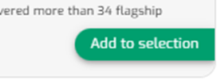
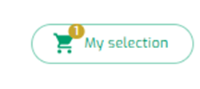
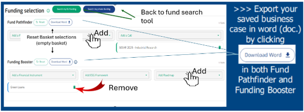
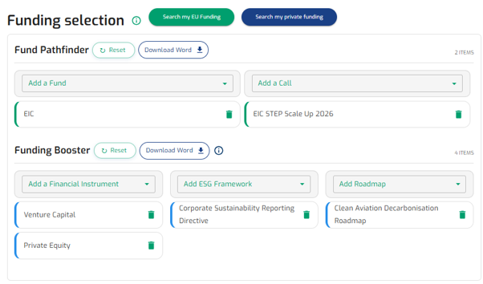

**Funding selection:** a space to temporarily store selected information from Fund Pathfinder and Funding Booster and export to a word format. 

- Select an element 

{fig-align="center" width="150" height="58"}

- Access My selection area

{fig-align="center" width="150"}

------------------------------------------------------------------------

**Default**

The Selection view consists of a **Fund Pathfinder (EU funding)** and **Funding Booster (private funding)** space: the user can select/add, view, and remove all the funds/calls and financial instruments previously selected. They can also add, view and remove ESG frameworks and Roadmaps.

{fig-align="center"}

{fig-align="center"}

------------------------------------------------------------------------

**Output**

- **Fund Pathfinder**: Sustainable business case including a selection of Funds and/or Calls and relevant EU funded project cases.

- **Funding Booster**: Sustainable business case defined by a single, selected financial instrument, that may include a linked ESG framework and/or a linked Roadmap.
