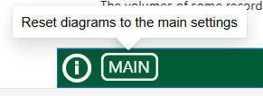
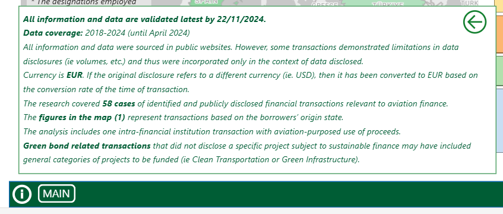
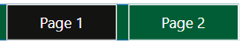
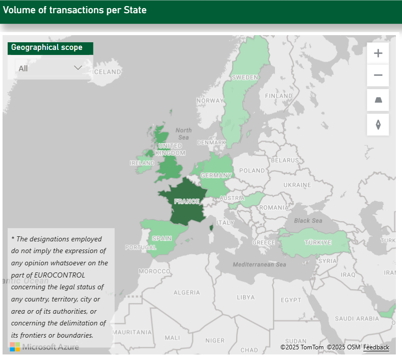
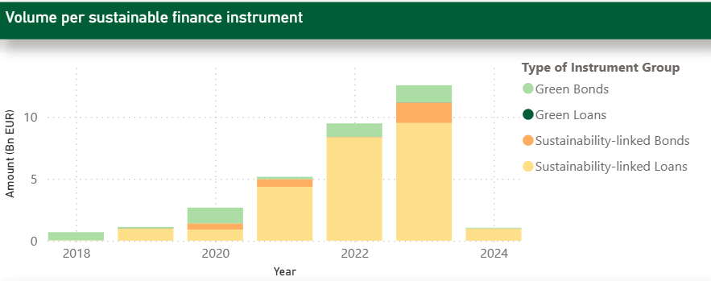
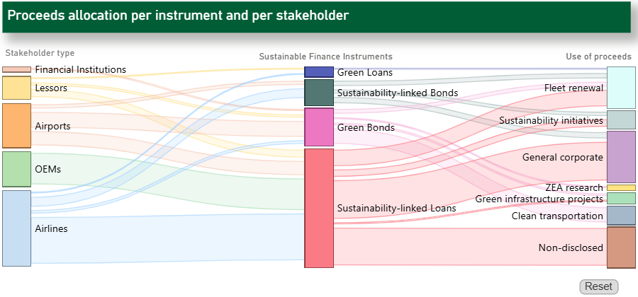
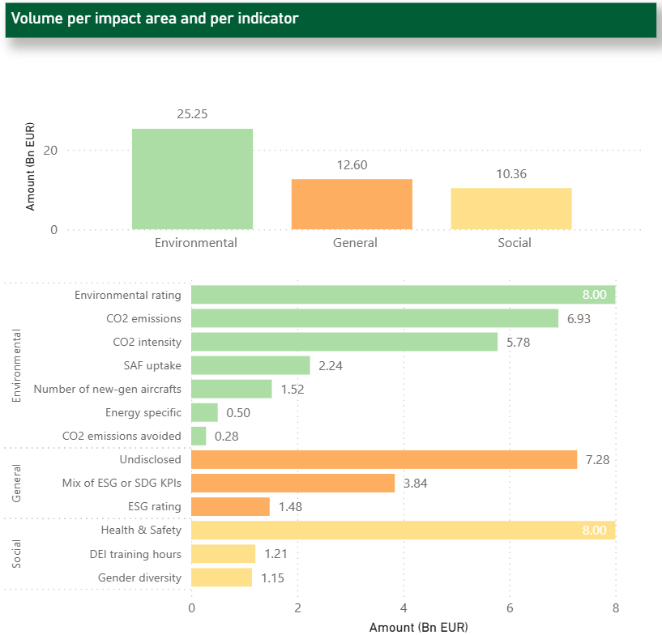
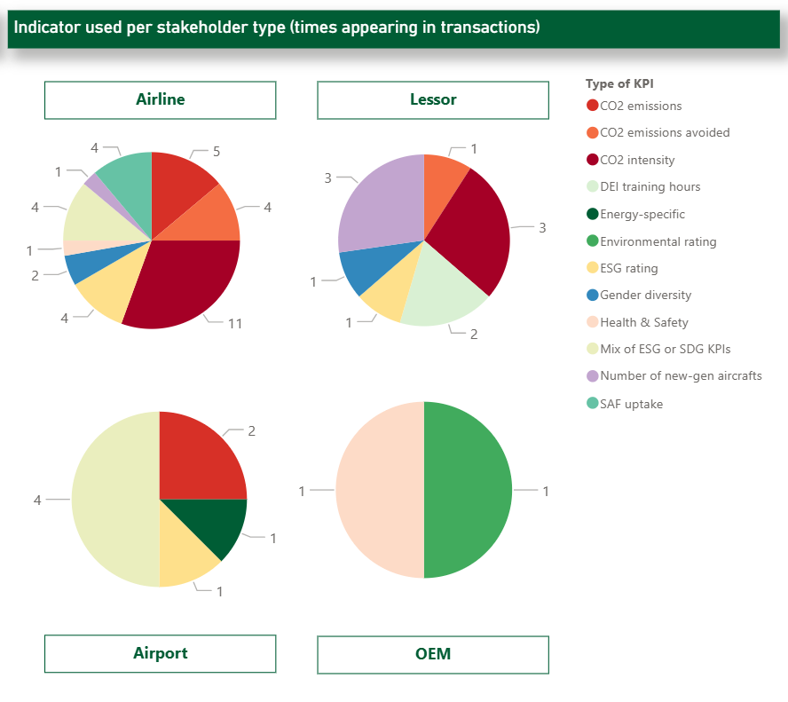

**Guidelines**

Below, there are some guidelines to help users read and interact with each of the visuals presented in the sustainable finance dashboard.

{fig-align="center" width="100"}

-   Clicking the **How to use** icon, the user is transferred to the user manual for instructions around using the FLYnance! dashboard.

{fig-align="center"}

-   Clicking the **Main** icon, the user resets the visuals to the main version before selecting and filtering.

{fig-align="center"}

-   Clicking the **(i)** button, the user unfolds specific information around the methodology of the collection of the data and information appearing in the FLYnance! dashboard.

{fig-align="center"}

-   Clicking the **Page** button, the user is transferred to page 1 or 2 and the respective dashboard material.

{fig-align="center"}

-   Clicking the **Reset** button below the **Sankey diagram**, the user returns the visual to its initial version (no items selected).

------------------------------------------------------------------------

**Map chart**

**Main Indicator:** volumes of financial transactions per State

**Explanation:** the value indicated over each state on the map represents the sum of disclosed and (recorded) financial transactions with proceeds to be invested in aviation sustainability projects – environmental, social or general sustainability initiatives. Once the user clicks on a State, a short message pops up indicating the total volume of transactions recorded in that State.

For *States with recorded transactions but undisclosed volumes*, a message ‘’Not disclosed’’ appears.

The diagram responds to the question: “What is the volume of monetary resources allocated to financing sustainable aviation projects per State associated with lending by financial institutions?”

**Main Filtering:** the user can change the geographical scope of the map by selecting either All (both ECAC and non-ECAC States appear) or ECAC (ECAC States where financial transactions that have been recorded only appear) or Global (non-ECAC States where financial transactions have been recorded appear).

**Menu:** +/- Zoom in/out map

------------------------------------------------------------------------

**Bar chart**

**Main Indicator:** volumes per type of instrument

**Explanation:** the size of each bar corresponds to the total volume of recorded financial transactions for the respective year where the colored sub-sections correspond to the magnitude of financial transactions per type of instrument (Sustainability-linked Loans, Sustainability-linked Bonds, Green Loans and Green Bonds).

It responds to the question: “What are the volumes per type of sustainable finance instruments allocated to sustainable aviation projects supported by the banking sector for the years 2018 – 2024?”

**Main Filtering:** the user can isolate a specific type of instrument at any year by just clicking on the instrument type on the legend. A menu appears with the name of the instrument type, the year and the amount.

------------------------------------------------------------------------

**Sankey diagram**

{fig-align="center"}

**Main Indicator:** flows of financial transactions between aviation stakeholder involved, sustainable finance instrument used, and use of proceeds raised.

**Explanation:** the figure depicts financial flows (thickness of the colored arrow corresponds to the size of the volume) between the different aviation stakeholder groups, the financial instruments used and the categories of use of proceeds (purpose of investments). It responds to the question: “What type of aviation operational stakeholders are involved in sustainable finance, what are the most common lending instruments used and where are the proceeds allocated to?”

All the categories stem from already disclosed transactions and, in the case of the use of proceeds they were classified by EUROCONTROL to specific categories.

The user can hover the mouse over and a menu appears with the following data: Use of Proceeds, Sustainable finance instrument and Stakeholder type as well as the value that the flow represents.

**Main Filtering:** the user can isolate or exclude a specific stakeholder type, sustainable finance instrument or use of proceeds by clicking the respective element.

------------------------------------------------------------------------

**Bar charts**

{fig-align="center"}

**Main Indicator:** volumes of financial transactions allocated per indicator and per impact area.

**Explanation:** the size of each bar corresponds to the total volume of recorded financial transactions allocated to specific indicators as part of the sustainable finance transactions between borrowers and financial institutions. There is a number of transactions that have not disclosed specific indicators but have disclosed specific transaction volumes (Undisclosed in the figure).

Moreover, the Total value under each Environmental, Social and General category corresponds to the sum of the respective indicators.

The graph responds to the question: “what type of indicators have been used for aviation projects financed via sustainable financing by the private sector and what are the volumes associated with those indicators?”

**Main Filtering:** The user can highlight specific categories by clicking on the respective indicator and the relevant category is also highlighted in the graph above.

------------------------------------------------------------------------

**Pie charts**

{fig-align="center"}

**Main Indicator:** times an indicator appears in financial transactions per type of aviation stakeholder involved.

**Explanation:** the figure explains what type of indicators are used in financial transactions and the type of stakeholder involved in those transactions.

In short, it responds to the question: “what type of indicators are used per each stakeholder group in sustainable finance transactions?".

**Main Filtering:** the user can isolate or exclude a specific indicator by clicking the respective indicator in the legend.

Consequently, the indicator is highlighted in all relevant diagrams and viceversa, the user can click a pie and the respective indicator will be highlighted in the legend as well.
