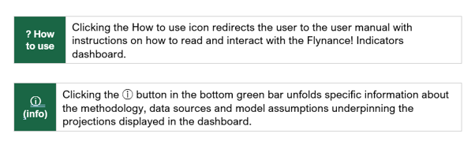
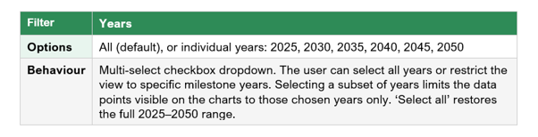
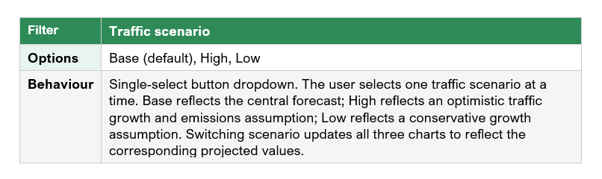
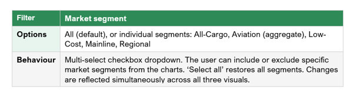
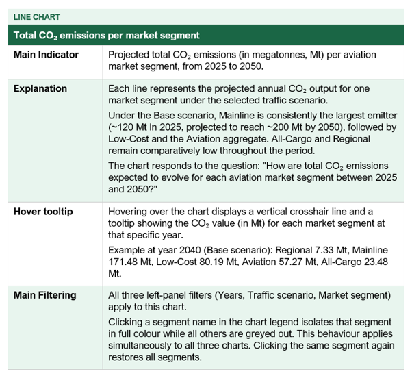
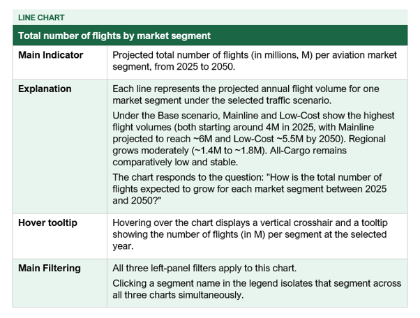
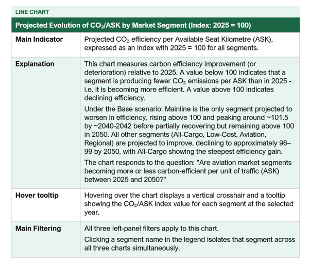

**Navigation Icons**

The following icons are available in the dashboard header and footer:

{fig-align="center"}

------------------------------------------------------------------------

**Filters**

Three filters are available on the left-hand panel and apply simultaneously to all three charts. Changes to any filter are reflected across the entire dashboard in real time.

{fig-align="center" width="600"}

{fig-align="center" width="600"}

{fig-align="center" width="600"}

------------------------------------------------------------------------

**Visuals**

The dashboard contains three-line charts, all sharing the same market segment colour coding: All-Cargo (solid green), Aviation (dotted teal), Low-Cost (solid blue), Mainline (solid red), Regional (solid yellow).

{fig-align="center"}

{fig-align="center"}

{fig-align="center"}

------------------------------------------------------------------------

**Glossary of Terms**

The table below defines key terms and categories used across the Flynance! Indicators dashboard.

| **Term** | **Definition** |
|:---|:---|
| **CO₂ (Mt)** | Carbon dioxide, expressed in megatonnes (1 Mt = 1 million metric tonnes). The primary greenhouse gas metric used to assess aviation’s climate impact. |
| **ASK (Available Seat Kilometre)** | A standard measure of airline capacity: one ASK equals one available passenger seat flown one kilometre. Used as the denominator in the CO₂/ASK efficiency metric. |
| **CO₂/ASK** | Carbon intensity of aviation expressed as CO₂ emissions per Available Seat Kilometre. A declining CO₂/ASK indicates improving fuel and carbon efficiency per unit of capacity offered. |
| **CO₂/ASK Index (2025 = 100)** | A normalised index setting each market segment’s CO₂/ASK value to 100 in 2025. Values below 100 in subsequent years indicate efficiency improvements relative to the base year; values above 100 indicate a deterioration. |
| **Market segment — Mainline** | Full-service carriers operating scheduled long- and medium-haul routes. Typically, the largest contributor to total CO₂ emissions in the dataset. |
| **Market segment — Low-Cost** | Low-cost carriers (LCCs) operating primarily short- to medium-haul point-to-point routes with a focus on cost efficiency. |
| **Market segment — Regional** | Carriers operating short-haul regional and feeder routes, typically with smaller aircraft types. |
| **Market segment — All-Cargo** | Operators dedicated exclusively to freight transport. Excluded from ASK-based efficiency calculations; CO₂/ASK does not apply in the same sense as for passenger segments. |
| **Market segment — Aviation** | An aggregate or cross-segment reference category representing total or combined European aviation, shown as a dotted line to differentiate it from individual operator-type segments. |
| **Traffic scenario — Base** | The central or most likely traffic growth forecast, reflecting balanced assumptions about economic growth, fleet renewal and market development. |
| **Traffic scenario — High** | An optimistic traffic growth scenario assuming stronger-than-expected demand, faster fleet expansion and favourable economic conditions. |
| **Traffic scenario — Low** | A conservative traffic growth scenario assuming slower-than-expected demand recovery, constrained fleet growth or adverse economic conditions. |
| **Projection horizon** | The period covered by the forecasts: 2025 to 2050, with data points available at five-year intervals (2025, 2030, 2035, 2040, 2045, 2050). |
