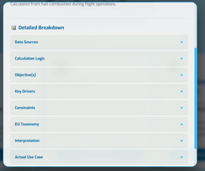
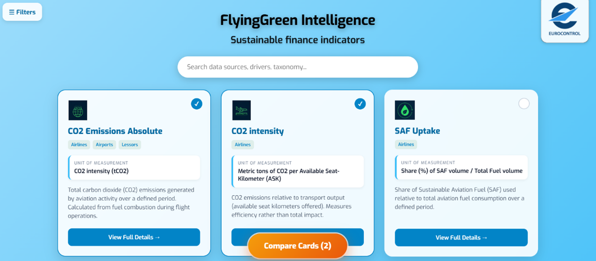
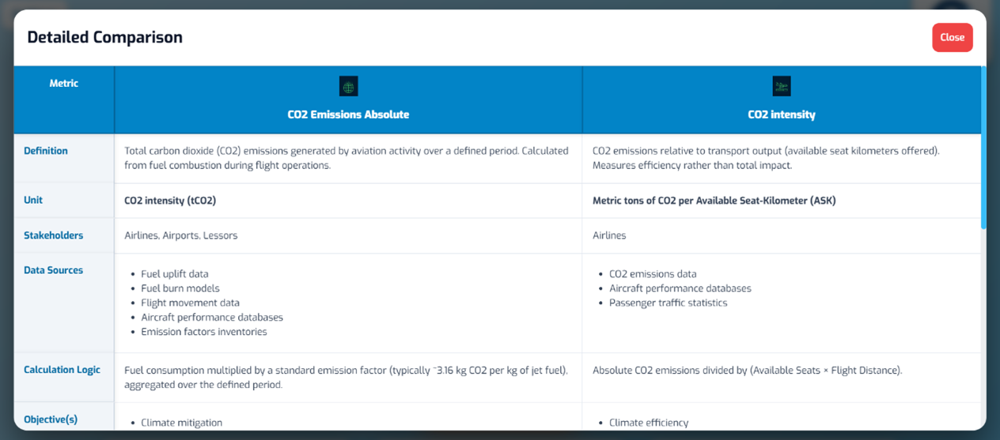
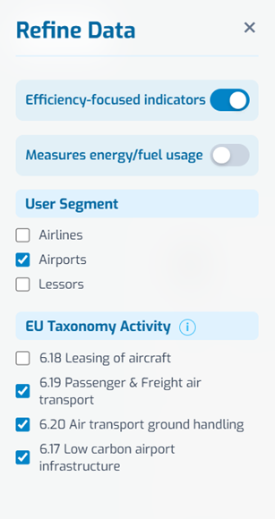
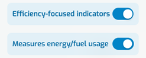
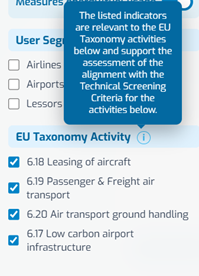
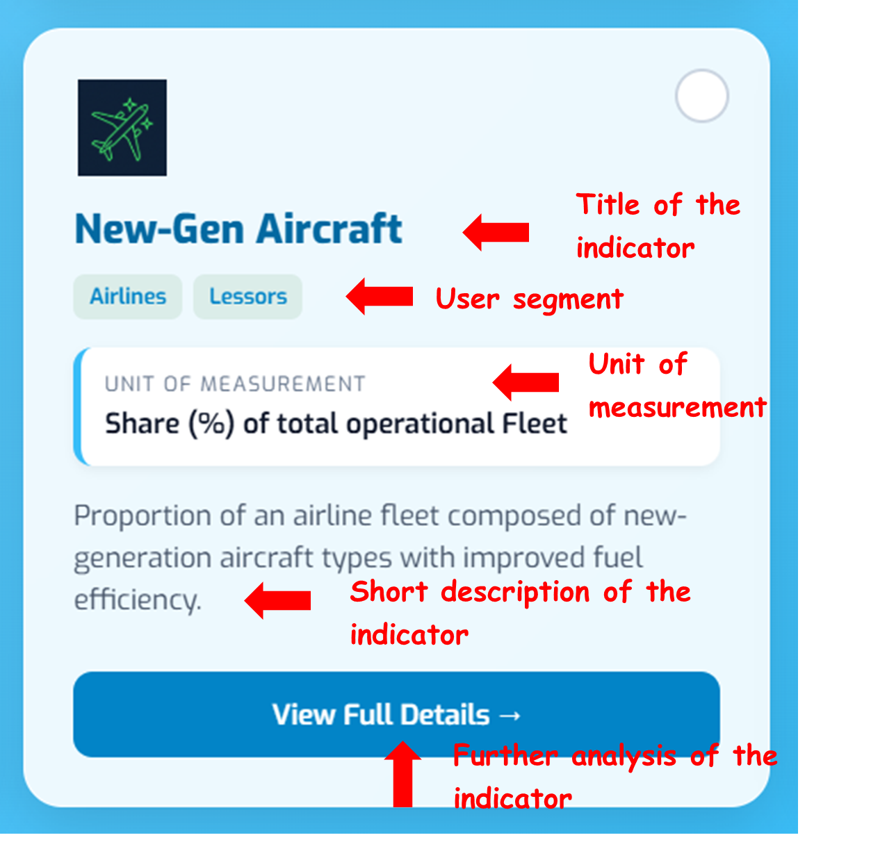
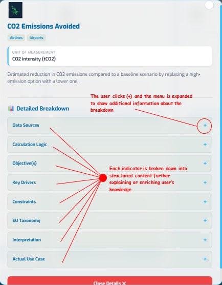

**Guidelines**

Below are guidelines to help users navigate the catalogue of indicators and the filtering system.

-   **Indicator Cards:** Each card represents a unique metric (e.g., CO~2~ intensity, SAF uptake). Clicking a card provides a deep dive into the definition and multi-aspect content of that metric.

    -   **Clicking on View Full Details** à the card flips and the user has access to additional information around the indicator.

        {fig-align="center" width="263"}

-   **Compare Cards:** Selecting the "click to compare" option top right on multiple cards populates the **Compare Cards (n)** table at the bottom of the screen enabling real-time comparison of each indicator’s drivers simultaneously.

{fig-align="center" width="450"}

-   **Detailed Comparison:** Clicking this button opens a side-by-side view of the selected indicators to analyze differences in their methodology or applicability.

{fig-align="center" width="450"}

-   **Filters Menu:** Located at the top/side, this allows users to narrow down the list of indicators based on specific regulatory or operational needs.

{fig-align="center" width="324"}

----------

**Refine Data (Filters)**

**Efficiency & Energy Usage**

-   **Explanation:** Users can toggle between **Efficiency-focused indicators** (e.g., metrics tracking output vs. input) and **Energy/Fuel usage** (metrics tracking energy consumption or source types).

-   **Utility:** Helps users find indicators specifically for "Environmental" performance reporting versus "Operational" optimization.

{fig-align="center" width="221"}

----------

**User Segment**

-   **Main Indicator:** Target stakeholder group.

-   **Explanation:** Filters the indicators based on who is responsible for reporting them and/or who is primarily impacted:

    -   **Airlines:** Indicators related to aircraft operators, airspace users and fleet and relevant emissions.

    -   **Airports:** Indicators related to airport/ground infrastructure and local emissions.

    -   **Lessors:** Indicators related to asset management and emissions.

{fig-align="center" width="221"}

----------

**EU Taxonomy Activity**

-   **Main Indicator:** Regulatory alignment.

**Explanation:** This is a critical filter for financial reporting. It maps indicators relevant to the four primary aviation activities including in EU Taxonomy by 2026:

-   **6.17:** Low carbon airport infrastructure.

-   **6.18:** Leasing of aircraft.

-   **6.19:** Passenger & Freight air transport.

-   **6.20:** Air transport ground handling.

**The selection responds to the question:** "Which indicators should I use to better demonstrate my activity is 'Taxonomy Aligned' under the Technical Screening Criteria?"

{fig-align="center" width="160"}

----------

**Indicator Comparison Tool**

**Main Indicator: Side-by-side metric analysis.**

-   **Explanation:** Once the user has refined the data, they can select specific indicators to see a detailed breakdown.

-   **Comparison Fields:** Besides the title of the metric and the definition below are the comparison fields:

    -   **Unit:** The specific scale or metric used to quantify the data (e.g., gCO~2~/RPK, litres of fuel, or percentage of SAF).

    -   **Stakeholders:** The primary entities responsible for tracking or impacted by the metric (e.g., Airlines, Airport Operators, or Aircraft Lessors).

    -   **Data sources:** The specific origin of the data/information, such as airline flight logs, airport energy bills, aircraft performance databases or other EUROCONTROL’s central databases.

    -   **Calculation logic:** The mathematical formula or step-by-step methodology used to derive the indicator's value from raw operational data.

    -   **Objective(s):** The specific environmental the indicator aims to track, such as "climate mitigation".

    -   **Key drivers:** The underlying factors that cause the indicator to change, such as fuel consumption, payload weight, or aircraft type.

    -   **Constraints:** The limitations or external factors that might hinder accurate measurement, reveal direct effect on other indicators or proper interpretation of the metric (e.g., technology constraints or penalising traffic growth).

    -   **EU Taxonomy:** Reference to the specific EU Taxonomy activity/-ies (e.g., Activity 6.19) that the indicator helps meet for defining sustainable activity status.

    -   **Interpretation:** Guidance on how to read the indicator and under which conditions or enablers it better applies.

    -   **Actual use cases:** Real-world examples of how this indicator has been applied in financial deals, such as being a KPI for a Sustainability-Linked Bond.
    
----------

**Front – side of cards**

{fig-align="center" width="304"}

----------

**Back – side of cards**

{fig-align="center" width="304"}

----------

**Navigation Icons**

-   **Drawer Toggle:** Expands or collapses the detailed comparison view at the bottom of the screen.

----------

**Search content**

The user can enter words or phrases and relevant categories or content appear in the results field.

{fig-align="center" width="304"}
