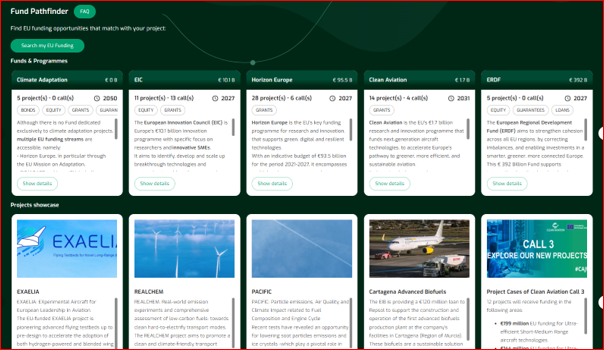
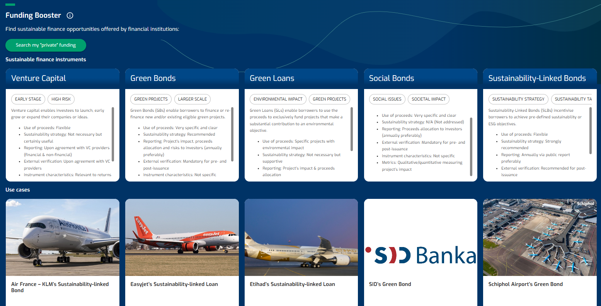
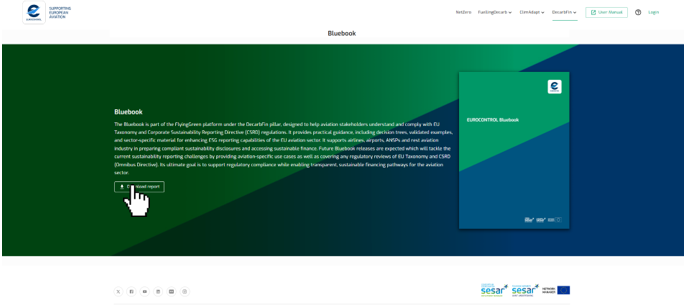

As financing aviation decarbonisation proves challenging, due to limited access to sustainable finance and evolving regulatory landscape, **DecarbFin** provides you with tools and information necessary to facilitate your access to public and private sustainable funding opportunities.

Check out also the **Bluebook**, a guide for enhanced ESG reporting and compliance with the EU Taxonomy and CSRD to help you navigate this complex regulatory and reporting landscape. **FLYnance!** provides an overview of the latest market trends based on the financial transactions and their features such as financial flows, aviation stakeholders involvement, performance indicators used, type of initiatives financed, etc. Moreover, **FLYnance! indicators** offer insights on operational indicators currently used in financing sustainable aviation.

------------------------------------------------------------------------

### Sections

#### 1) Fund Pathfinder – Search my EU funding

#### 2) Funding Booster – Search my private funding

#### 3) Bluebook – Download the Bluebook 

#### 4) FLYnance! – View the FLYnance! dashboard

------------------------------------------------------------------------
