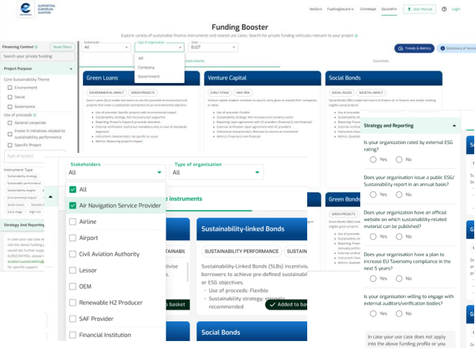
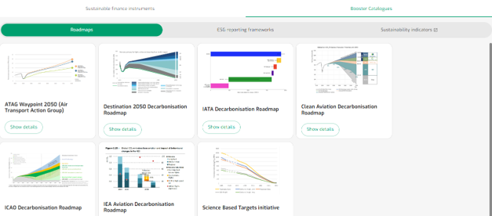

**Query**

- *Type of stakeholder:* definition of stakeholder type

- *Project purpose:* selection of the purpose of the proceeds (project – based or non-project based)

  - Core sustainability theme

  - Use of proceeds

  - Instrument Type

- *Strategy and Reporting:* profiling of sustainability strategy and reporting capabilities of the company

{fig-align="center"}

------------------------------------------------------------------------

**Output**

List of search results pertaining to sustainable finance instruments

{fig-align="center"}

------------------------------------------------------------------------
