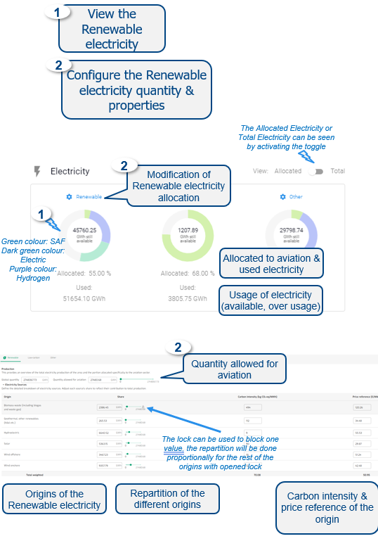

{fig-align="center"}

------------------------------------------------------------------------

**Default**

• Default Electricity are Renewable, Low-Carbon & Other

• Quantities values are prefilled for some Areas/States

• Share of origins is proportionally distributed between origins

• Carbon intensity & price reference are prefilled for some Areas/States

• Conversion efficiency prefilled and not editable

------------------------------------------------------------------------

**Output**

The Renewable electricity results are presented on the Electricity donut chart.

The modification of the Renewable electricity quantities impacts the quantity available per Type of electricity for Hydrogen Fuel, Electric aircraft and SAF.

------------------------------------------------------------------------

**Data**

EUROCONTROL research, EUROCONTROL Aviation Outlook (Long Term Forecast report), IEA, EEA, Lazard, Deutsche Bank economic research reports, European Commission - Cost of Energy 2020 report - prepared by TRINOMICS, Fraunhofer Institute for Solar Energy Systems, EIA, McKinsey.
