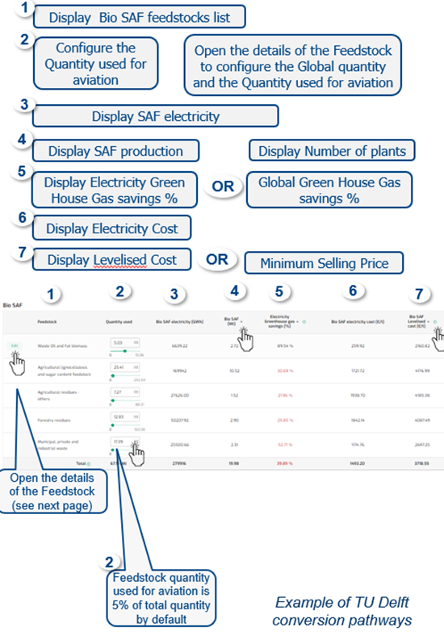
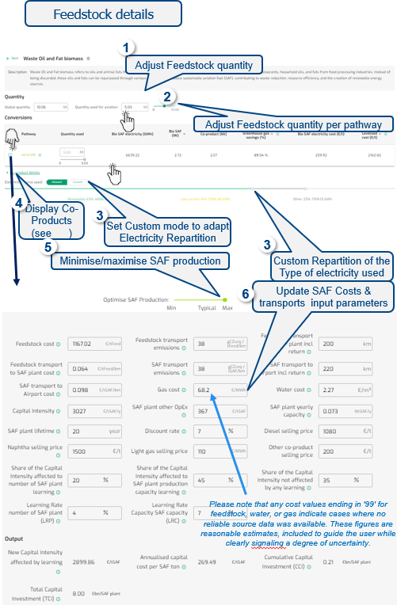
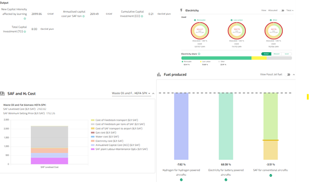

### Bio SAF production

{fig-align="center"}

---

### Bio SAF feedstock and costs details

{fig-align="center"}

---

### Bio SAF production electricity and costs overview

**Default**

-   Default Pathways per Feedstock

-   Default Electricity are Renewable, Low-Carbon & Other

-   Quantities values are prefilled for some Areas / States

------------------------------------------------------------------------

**Output**

The Bio SAF Fuel production results are presented on the Fuel produced, electricity and SAF and H2 charts.

{fig-align="center"}

------------------------------------------------------------------------

**Data**

CONCAWE and Imperial College London data, FAO , EUROCONTROL research, EUROSTAT, Fraunhofer Institute for Solar Energy Systems, ICCT, IEA, EMBER, IRENA EEA, Project SkyPower, TU Delft, Trinity College of Dublin, ASTM standards.

The CONCAWE dataset was amended for manure feedstock in Greece. For more details on SAF pathways data, please also consult “About data” section on the site. Sewage feedstock were from EUROSTAT, amended with ICCT methodology by excluding volumes used for agriculture, composting.

Therefore only volumes used for incineration, landfilling, and other use considered eligible feedstock for SAF production .

***NB:*** All the feedstock considered in FuellingDecarb is complying with ‘not for feed and food’ principles as per the revised [Renewable Energy Directive (EU/2023/2413)](https://eur-lex.europa.eu/legal-content/EN/TXT/?uri=CELEX%3A32023L2413&qid=1699364355105) (and other related EU directives).
