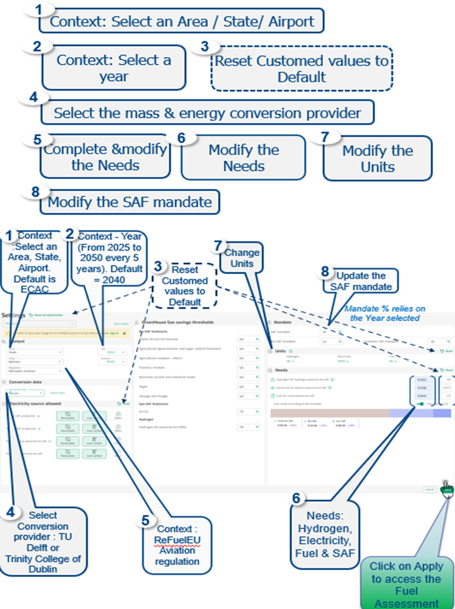
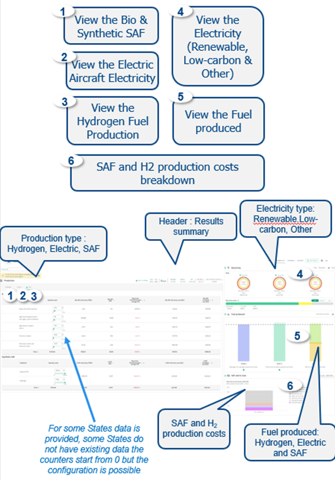

### Settings page

{fig-align="center" width="500"}

------------------------------------------------------------------------

**Default** 

- Default Area is ECAC

- Default Year is 2040

- Default Regulation is ReFuel EU Aviation (Mandate corresponding to 2040)

Needs values are prefilled for some Areas / States

---

**Output**

The Settings impact the Fuel Assessment goals to reach on SAF production, Hydrogen production and Electric production.

---

**Data**

EU Commission, EASA and ICAO. ECAC Member States list.

---

**Definitions**

***SAF:*** Sustainable Aviation Fuel, a bio or synthetic fuel used to power aircraft with smaller carbon footprint than conventional jet fuel.

***GHGs:*** Green House Gas savings

***Feedstock:*** Sources from which the SAF is produced. The feedstock is here presented in two different categories considered:

- *Bio SAF feedstocks:* biomass such as agricultural and forestry residues, municipal waste or algae.

- *Synthetic SAF feedstocks:* H2-CO2

***Electricity sources***

- *Renewable:* In this context, electricity source coming from renewable source (i.e solar, hydroelectric, wind).

- *Low-carbon:* In this context, electricity produced with nuclear power plants.

- *Other:* in this context, electricity sources not coming from renewable or low-carbon sources (such as coal, oil and gas electricity sources).

***Battery powered aircraft:*** Aircraft partially or fully powered via an electric battery (hybrid-electric or full electric aircraft).

***Hydrogen powered aircraft:*** Aircraft  powered  by hydrogen via Direct combustion in jet engines or via fuel cell to produce electricity for electric engines.

---

### Fuel assessment page

{fig-align="center"}

------------------------------------------------------------------------

**Default**

• Default Fuel is SAF

• Default Electricity are Renewable, Low-Carbon(nuclear energy) & Other (fossil sources of energy)

• Imported electricity price is the average electricity price of the 5 neighbouring countries.

• Quantities values are prefilled for EU27, ECAC, US, China and World

------------------------------------------------------------------------

**Output**

The Fuel Assessment provides information on the Fuel to produce. The different zones of the Fuel Assessment allow a personalised configuration of the Fuel produced.

------------------------------------------------------------------------

**Data**

CONCAWE and Imperial College London data, EUROCONTROL research, EUROSTAT, FAO, Fraunhofer Institute for Solar Energy Systems, ICCT, IEA, IRENA, EMBER, EEA, Project SkyPower, TU Delft, Trinity College of Dublin, ASTM standards.

For more details on SAF pathways data, please also consult “About data” section on the site.

{fig-align="center"}

------------------------------------------------------------------------

**Definition**

***TU Delft SAF conversion available:***

• *HEFA-SPK:* Hydrotreated Esters and Fatty Acids (HEFA) transformed in Synthesised Paraffinic Kerosene.

• *FT-SPK:* Synthesised paraffinic kerosene produced via Fischer-Tropsch process.

• *ATJ :* Alcohol to Jet production process

• *ATJ-SPK:* Synthesised paraffinic kerosene produced with Alcohol to Jet

• *PTL :* Power to Liquid via Fischer-Tropsch synthesis process.

***Trinity College Dublin SAF conversion available:***

• *HEFA-SPK (NG no CCS):* Natural gas for heat & H2 no carbon capture sequestration.

• *FT-SPK:* Synthesised paraffinic kerosene produced via Fischer-Tropsch process.

• *MtJ:* bioMethanol to Jet process. Agricultural residues to produce biomethane, methanol and convert it to jetfuel (ASTM D4054 certification ongoing).

• *HTL:* Hydrothermal liquefaction via electricity or hydroge, (not yet certified).

• *PTL :* Power to Liquid via liquid sorbent DAC and Fischer-Tropsch synthesis process.

• *PTL :* Power to Liquid via solid sorbent DAC and Fischer-Tropsch synthesis process.

• *PTL:* Power to Liquid process via MtJ process (not yet certified)
