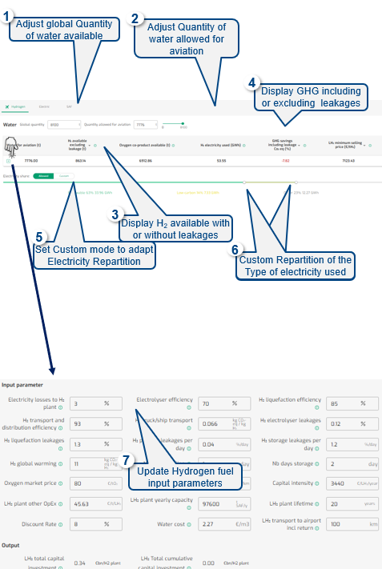
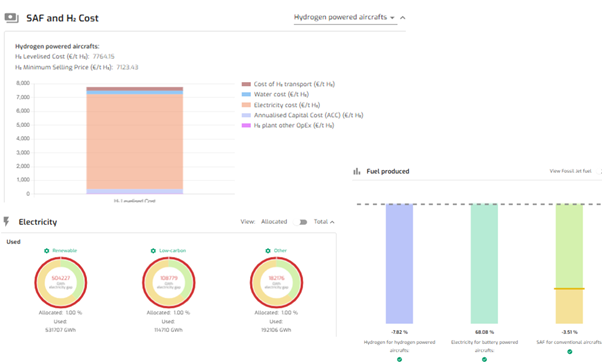

{fig-align="center"}

------------------------------------------------------------------------

**Default**

• Default Electricity are Renewable, Low-Carbon & Other

• Quantities values are prefilled for some Areas / States

• Conversion efficiency

------------------------------------------------------------------------

**Output**

The Hydrogen Fuel production results are presented on the Fuel produced chart. Depending on the Type of electricity selected and the Quantity of electricity usage the donut charts are updated.

{fig-align="center"}

------------------------------------------------------------------------

**Data**

EUROCONTROL research, EUROCONTROL Aviation Outlook (Long Term Forecast report), IEA, EEA, ASTM standards.
