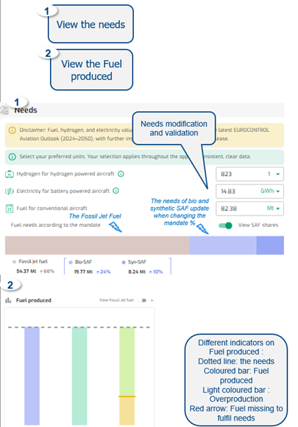

{fig-align="center"}

------------------------------------------------------------------------

**Default**

• Default Needs are Hydrogen, Electricity & Fuel

• Needs values are prefilled for some Areas / States

• Default Fuel produced chart are Hydrogen, Electricity & SAF

------------------------------------------------------------------------

**Output**

The Fuel produced results are presented on the Fuel produced chart.

The results presentation are compared to the needs in the settings page.

------------------------------------------------------------------------

**Data**

CONCAWE and Imperial College London data (low scenario) , 2021 EU report on Energy and GHG emissions, EUROCONTROL research, EUROCONTROL Aviation Outlook (Long Term Forecast report), FAO, IEA, EEA, ASTM standards. Lazard, Deutsche Bank economic research reports, European Commission - Cost of Energy 2020 report - prepared by TRINOMICS, Fraunhofer Institute for Solar Energy Systems, EIA, McKinsey.
