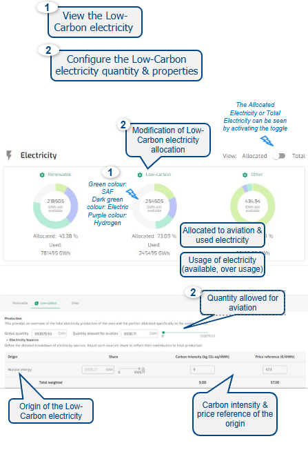

{fig-align="center"}

---

**Default**

• Default Electricity are Renewable, Low-Carbon & Other

• Quantities values are prefilled for some Areas/States

• Origin is Nuclear energy

• Carbon intensity & price reference are prefilled for some Areas/States

• Conversion efficiency prefilled and not editable

------------------------------------------------------------------------

**Output**

The Low-Carbon electricity results are presented on the Electricity donut chart.

The modification of the Low-Carbon electricity quantities impacts the quantity available per Type of electricity for Hydrogen Fuel, Electric aircraft and SAF.

------------------------------------------------------------------------

**Data**

CONCAWE and Imperial College London data, 2021 EU report on Energy and GHG emissions, EUROCONTROL research, EUROCONTROL Aviation Outlook (Long Term Forecast report), FAO, IEA, EEA, ASTM standards.

The 2021 EU report on Energy, Transport and GHG emissions data was amended to reflect national policy changes impacting low carbon production.
