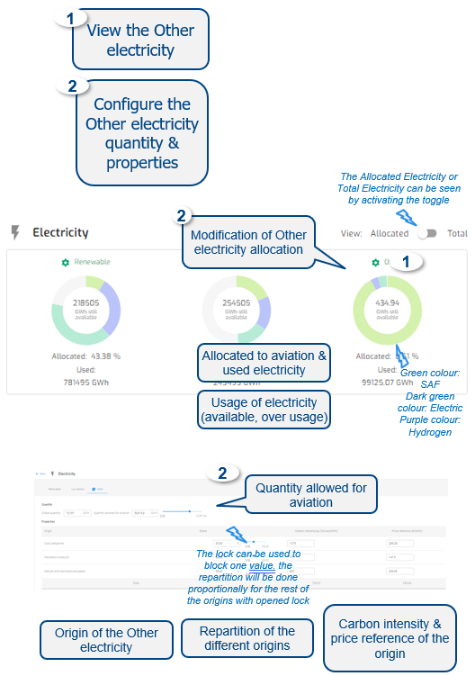

{fig-align="center"}

------------------------------------------------------------------------

**Default**

• Default Electricity are Renewable, Low-Carbon & Other

• Quantities values are prefilled for some Areas/States

• Share of origins is proportionally distributed between origins

• Carbon intensity & price reference are prefilled for some Areas/States

• Conversion efficiency prefilled and not editable

*The other sources of energy category cannot be used to fill the gap for electricity needs.*

***NB:*** Electricity costs for each ECAC State is corresponding to the Levelised Cost of Energy (LCOE).

------------------------------------------------------------------------

**Output**

The Other electricity results are presented on the Electricity donut chart.

The modification of the Other electricity quantities impacts the quantity available per Type of electricity for Hydrogen Fuel, Electric aircraft and SAF.

------------------------------------------------------------------------

**Data**

2021 EU report on Energy and GHG emissions, EUROCONTROL research, EUROCONTROL Aviation Outlook (Long Term Forecast report), IEA, EEA, ASTM standards.
