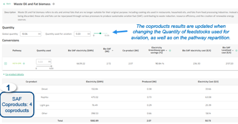

{fig-align="center"}

------------------------------------------------------------------------

**Default**

• Default Pathways per Feedstock

• Default Electricity are Renewable, Low-Carbon & Other

• Quantities values are prefilled for EU27, ECAC, US, China and World

------------------------------------------------------------------------

**Data**

CONCAWE and Imperial College London data, EUROCONTROL research, FAO, Fraunhofer Institute for Solar Energy Systems, IEA, EEA, TU Delft, Trinity College Of Dublin, ASTM standards.

*For more details on SAF pathways data, please also consult “About data” section on the site.*

------------------------------------------------------------------------
