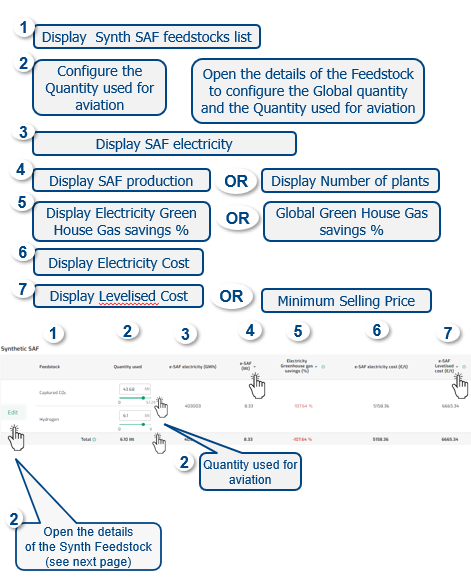
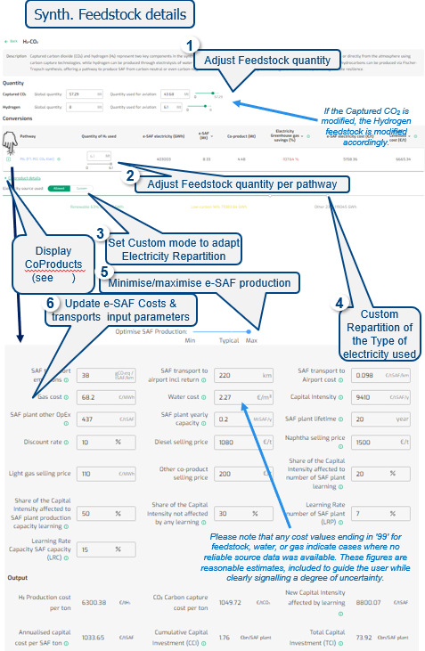
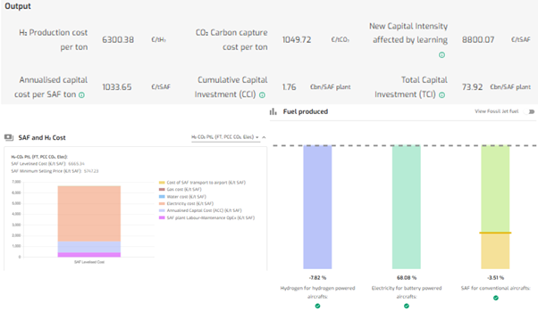

### Synthetic SAF production pathways and costs overview

{fig-align="center"}

------------------------------------------------------------------------

### Synthetic SAF detailed view on data modification and costs

{fig-align="center"}

------------------------------------------------------------------------

### Synthetic SAF production electricity and costs overview

**Default**

• Default Pathways is Power-to-liquid

• Default Electricity are Renewable, Low-Carbon & Other

• Quantities values are not prefilled

------------------------------------------------------------------------

**Output**

The Synthetic SAF Fuel production results are presented on the Fuel produced, SAF and H2 Cost and electricity charts. Depending on the repartition of the Type of electricity and the Quantity of feedstock usage the donut charts are updated.

{fig-align="center"}

------------------------------------------------------------------------

**Data**

CONCAWE and Imperial College London data (lower estimates), EUROCONTROL research, FAO, IEA, EEA, Project SkyPower , TU Delft, Trinity College of Dublin, ASTM standards.

For more details on SAF pathways data, please also consult “About data” section on the site.
