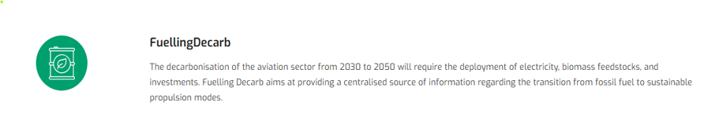
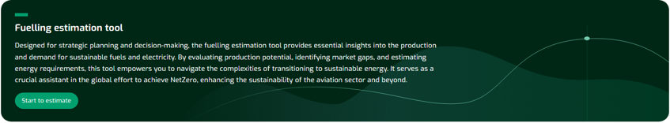
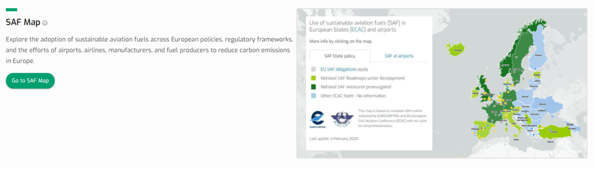
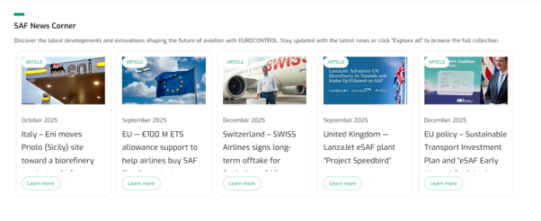

### Fuelling Decarb: Gateway to Informed Green Energy Choices

{fig-align="center"}

------------------------------------------------------------------------

The **FuellingDecarb** pillar of the platform allows to assess the volumes, costs and Minimum Selling Prices of Sustainable Aviation Fuel and the quantities of electricity and feedstock required to produce Sustainable Aviation Fuel (SAF) but also hydrogen, electricity for hydrogen and electric powered aircraft.​

------------------------------------------------------------------------

**Estimation Tool**

{fig-align="center"}

------------------------------------------------------------------------

**SAF Map**

{fig-align="center"}

------------------------------------------------------------------------

**SAF News Corner**

{fig-align="center"}

------------------------------------------------------------------------
